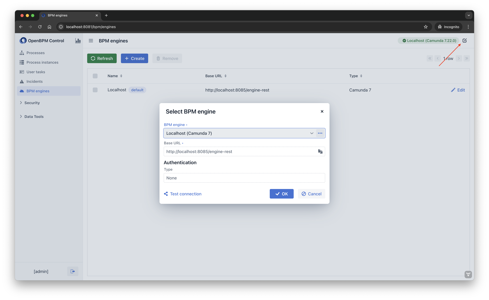
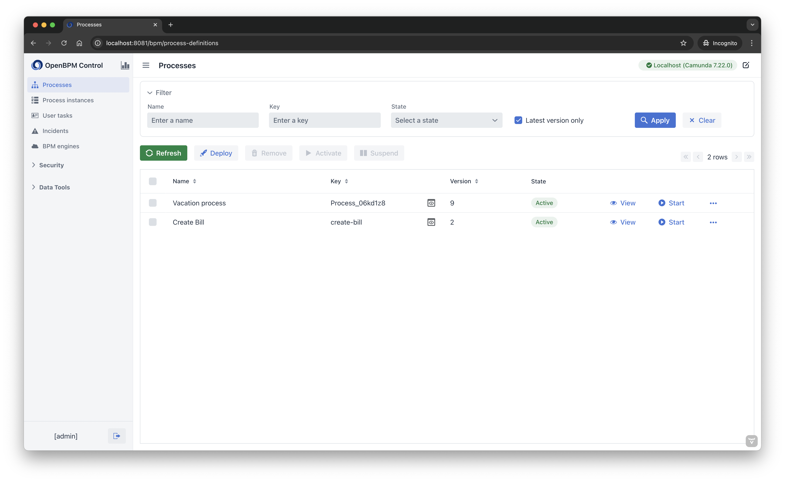
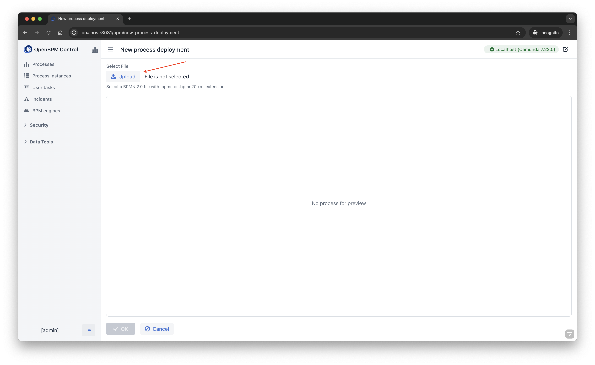
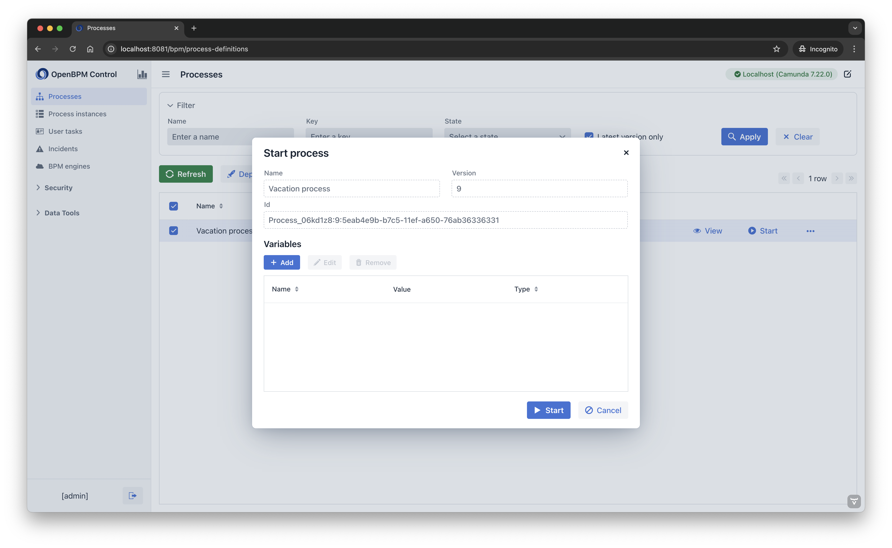
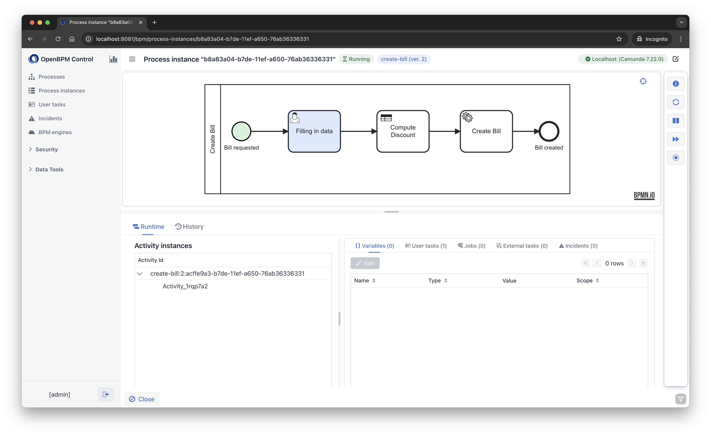
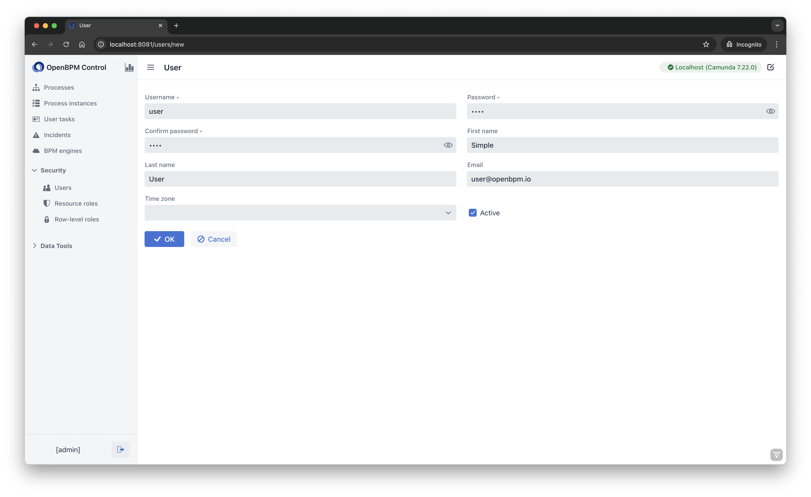
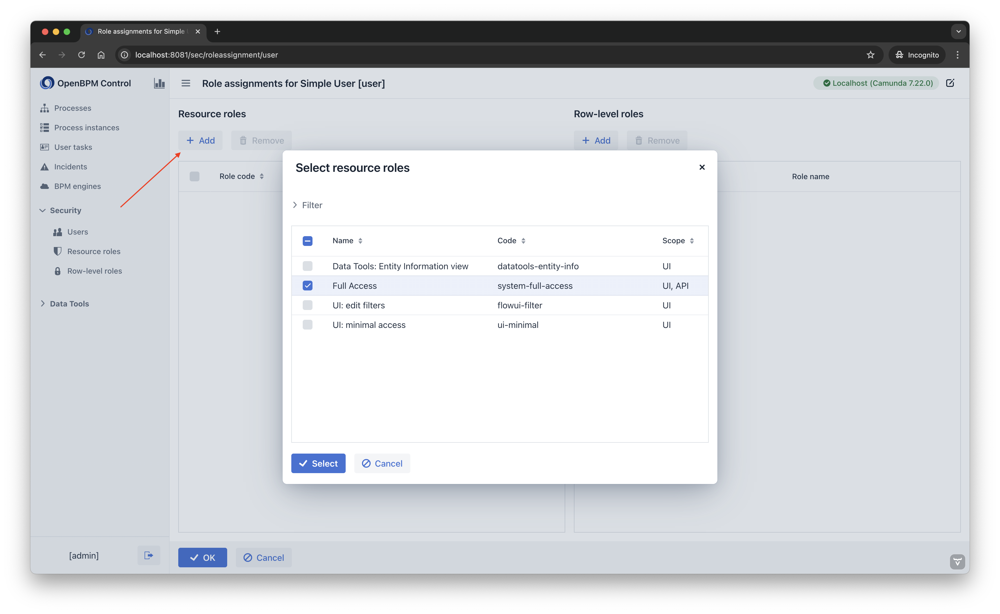

**Flowset Control Community** is a web application that provides administrative functionality for external BPM engines.

**Key Features**
- **Connection Management:** Easily set up connections to various BPM engines and switch between them as needed.
- **Process Browsing:** Navigate through the processes deployed to the engine.
- **Process Deployment:** Deploy a new version of a business process with a convenient diagram preview.
- **Instance Management:** Manage process instances currently running on the BPM engine.
- **User Task Management:** View user tasks with the ability to reassign them.

> [!NOTE]
> Currently, only Camunda 7 is supported. 

Flowset Control Community is built using the open-source [Jmix](https://www.jmix.io) framework.

## Table of Contents

- [Running the Application](#running-the-application)
   - [Docker Image](#docker-image)
   - [Using Sources](#using-sources)
- [Usage](#usage)
   - [Connecting to BPM Engines](#connecting-to-bpm-engines)
   - [Working with Processes](#working-with-processes)
     - [Deploying a Process](#deploying-a-process)
     - [Starting a Process](#starting-a-process)
   - [Managing Process Instances](#managing-process-instances)
   - [User Tasks](#user-tasks)
   - [Incidents](#incidents)
   - [Configuring Users](#configuring-users)
- [Running the Tests](#running-the-tests)  
- [License](#license) 


## Running the Application <a name="running-the-application"></a>

You can run Flowset Control Community using either a Docker image or from source code.

### Docker Image <a name="docker-image"></a>
This method allows running Flowset Control Community with a pre-built Docker image.

**Prerequisites:**

You must have the following installed:
1. Docker
2. Docker Compose

Instructions can be found [here](docker-compose/README.md).

### Using Sources <a name="using-sources"></a>
This method allows building and running Flowset Control Community locally with Gradle.

**Prerequisites:**

You must have the following installed:
1. Git
2. Java 21 (JDK and JRE)
3. PostgreSQL

**Instructions:**

1. Clone the repository:
    ```shell
     git clone https://github.com/flowset/flowset-control
    ```
2. Configure a PostgreSQL database.
   Flowset Control Community stores data such as connections to BPM engines in the database. 
   Flowset Control Community requires a PostgreSQL database by default:
   - Name: `flowset-control`
   - Connection username: `root`
   - Connection password: `root`
3. Navigate to the cloned project directory and open a terminal.
4. Run the following command:
   ```shell
    .\gradlew bootRun
   ```
The application is now running at http://localhost:8081 in the browser.

## Usage <a name="usage"></a>
Flowset Control Community requires authenticated access. An administrative user with the credentials `admin/admin` is provided 
from the start. To add more users, see the [Configuring Users](#configuring-users) section.

### Connecting to BPM Engines <a name="connecting-to-bpm-engines"></a>
To add a connection to a running BPM engine, follow these steps:

1. Navigate to the **BPM engines** view using the application menu.
2. Click **Create**.
3. In the **New BPM engine** view, provide the following details:
    - _Name_: a short name for your server where BPM engine is running. (e.g., `Dev stand`).
    - _Base URL_.
4. If the target BPM engine requires authenticated access, set the **Enabled** checkbox in the Authentication group to true.
   You can then configure the credentials needed for this connection.
5. Click the **OK** button to save the connection.


You can configure as many connections as needed.

In the upper right corner, you can see which engine Flowset Control Community is currently connected to.



To switch to another configured BPM engine, click the **Edit** button next to the engine status badge.


### Working with Processes <a name="working-with-processes"></a>

To view the business processes deployed on the selected BPM engine, click the **Processes** item in the application menu.
The **Processes** view will open, enabling you to filter and sort deployed processes displayed in the table.
By default, only the latest versions of deployed processes are displayed.

The following actions are also available:
- **Refresh:** reloads process list from the BPM engine.
- **Deploy:** an action to deploy a BPMN 2.0 XML to the BPM engine.
- **Remove:** removes selected deployed processes and associated instances.
- **Activate:** activates suspended process versions and associated instances.
- **Suspend:** suspends active process versions and their associated instances.
- **View:** displays the details of the deployed process such as diagram, BPMN 2.0 XML and more.



#### Deploying a Process <a name="deploying-a-process"></a>
You can deploy a new process or a new version of an existing process using the **Deploy** action available in the **Processes** view.
Clicking the **Deploy** button opens the **New process deployment** view.



To upload a BPMN 2.0 file, click the **Upload** button and select the process to be deployed.
After uploading, you can preview the diagram of the uploaded process and click the **OK** button to deploy to the BPM engine.

#### Starting a Process <a name="starting-a-process"></a>

To start a process instance immediately, simply click the **Start** button for the desired process.

To specify process variables prior to starting an instance, follow these steps:

1. Click **View** for the desired process.
2. Add required variables in the **Start process** dialog.
3. Click the **Start** button to start the process.



### Managing Process Instances <a name="managing-process-instances"></a>

To view process instances stored in the BPM engine, use the **Process instances** item in the application menu.

The **Process instances** view allows you to sort and filter the process instances loaded from the BPM engine. 
By default, only active instances are shown.


To view the execution details of a specific process instance, click the **View** button.

In the **Process instance** view, you can view runtime and history data related to this instance, including completed
and current activities, variable values, and more.

The right panel provides actions available for the process instance such as viewing instance information, activating 
or suspending the instance.



### User Tasks <a name="user-tasks"></a>

You can view active user tasks by selecting the **User tasks** item in the application menu. The **User tasks** view 
will open, enabling you to filter and sort the active tasks associated with the selected BPM engine. For tasks that are
not suspended, you have the option to complete or reassign them.


### Incidents <a name="incidents"></a>

You can view all opened incidents for the selected BPM engine by selecting the **Incidents** item in the application menu.
In addition to viewing, you can also increase the number of retries for incidents related to failed jobs and external tasks.


### Configuring Users <a name="configuring-users"></a>
Flowset Control Community stores users in the `USER_` table in the configured database.

#### Adding Users <a name="add-a-user"></a>

To add a new user, follow these steps:
1. Log in to Flowset Control Community with administrator credentials (by default, `admin/admin`).
2. In the menu, go to **Security** -> **Users** and then click the **Create** button.


3. In the opened **User** view, fill the required fields:
   - **Username**: should be a unique value
   - **Password** and **Confirm password**
4. Click **OK** to save the user.



#### User Permissions

Newly created users do not have any permissions and thus cannot log in to the application or use any of its functionality. 
To grant permissions to a user, follow these steps:

1. Select a user in the table and click the **Role assignments** button.
2. Click the **Add** button in the **Resource roles** group.
3. Select the row with the name **Full Access** and click the **Select** button.
4. Click **OK** to save.




The user can now log in to Flowset Control Community and use all the functionality.

## Running the Tests <a name="running-the-tests"></a>

**Prerequisites:**

You must have the following installed:

1. Docker

Flowset Control Community tests use [Testcontainers](https://testcontainers.com/) to run database and BPM engine containers.
and do not require a pre-prepared running instances for them.

To run all tests in Flowset Control Community, use the following command:

```shell
.\gradlew test
```

By default, all integration tests related to the BPM engine features are performed on the Camunda Run (version 7.22) which
does not have the configured authentication.
It is possible to run tests for a specific BPM engine version and authentication using the `test-engine` Spring
profile.

When the `test-engine` profile is enabled as the active profile, the following application properties become available:

1. `flowset.control.testing.engine.type` - a type of BPM engine. Supported values: `camunda_7`. Default value:
   `camunda_7`.
2. `flowset.control.testing.engine.docker-image` - the full docker image of the BPM engine. Supported
   values: [Camunda Run docker images](https://hub.docker.com/r/camunda/camunda-bpm-platform/tags?name=run).
   Default value: `camunda/camunda-bpm-platform:run-7.22.0`
3. `flowset.control.testing.engine.auth-type` - an authentication type for the BPM engine used in the tests. Supported values:
   `Basic`. Default value: null.

You can pass the values of these properties as environment variables or by using the `-P` prefix in the Gradle task command.

**Example 1: Run tests for Camunda Run (version 7.21)**

Using environment variable:

```shell
  SPRING_PROFILES_INCLUDE=test-engine;FLOWSET_CONTROL_TESTING_ENGINE_DOCKER_IMAGE=camunda/camunda-bpm-platform:run-7.21.0 .\gradlew test
```

Using Gradle command properties:

```shell
  .\gradlew test  -Dspring.profiles.include=test-engine -Dcontrol.testing.engine.docker-image=camunda/camunda-bpm-platform:run-7.21.0
```

**Example 2: Run tests for the default engine (Camunda Run 7.22) with basic authentication configured**

Using environment variable:

```shell
  SPRING_PROFILES_INCLUDE=test-engine;FLOWSET_CONTROL_TESTING_ENGINE_AUTH_TYPE=Basic .\gradlew test
```

Using Gradle command properties:

```shell
  .\gradlew test  -Dspring.profiles.include=test-engine -Dcontrol.testing.engine.auth-type=Basic
```

## License <a name="license"></a>
Flowset Control Community is an open-source project distributed under the [Apache 2.0](https://www.apache.org/licenses/LICENSE-2.0) license. 
