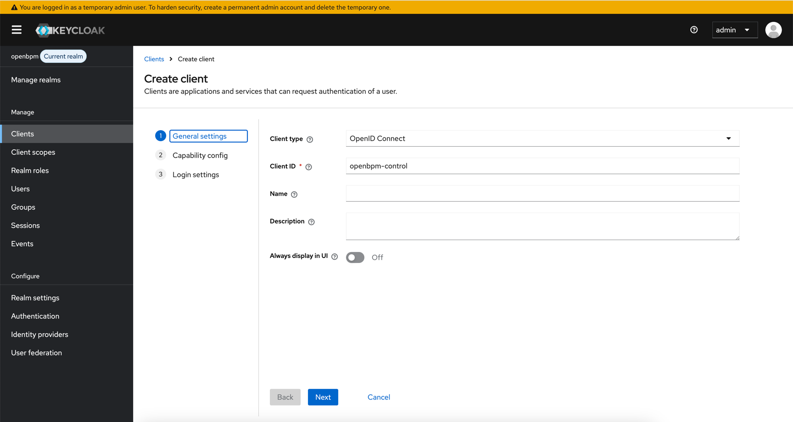

## Запуск Keycloak с помощью Docker Compose

Перед запуском OpenBPM Control, необходимо запустить Keycloak и настроить для дальнейшей работы.

### Создание realm

Войдите в консоль администратора Keycloak.

В верхней части левой панели нажмите **Add Realm**.

Укажите имя для новой области, например "openbpm".


### Создание клиента

Для подключения приложения Jmix к Keycloak необходимо создать нового клиента **openbpm-control** с протоколом **openid-protocol**.



Установите **Client authentication** в значение `true`.


Для Login Settings установите следующие значения (использовать только для разработки): 


После сохранения, перейдите на вкладку `Credentials` и скопируйте Client Secret для настройки OpenBPM Control (см. нижу).


Параметры клиента следует использовать в файле `application.properties`. См. раздел Настройка клиента.

### Создание роли

Далее необходимо создать новую роль области. По умолчанию имя роли должно соответствовать коду роли в Jmix. Создадим роль `system-full-access`.


### Создание полльзователя

Создадим пользователя с именем `johndoe`.


После сохранения пользователя появится вкладка **Credentials**. Здесь можно установить начальный пароль пользователя.


На вкладке **Role Mappings** назначьте роль **system-full-access**.


### Создание маппера

Чтобы информация о ролях возвращалась в ID Token, необходимо определить маппер для клиента **openbpm-control**. Откройте редактор клиента и перейдите на вкладку Mappers. Создайте там новый маппер. Коллекция имен ролей будет возвращена в утверждении "roles".


## Запуск OpenBPM Control

Используйте файл `docker-compose.yml` для запуска Control с базой данных Postgres.

Переменные для запуска контейнера вы можете найти в файле `.env`

```dockerfile
services:
  openbpm-control-app: # OpenBPM Сontrol web application exposed on the configured port (by default 8081)
    image: cr.yandex/crpocf4svpfi98epv13s/openbpm-control:1.0.0-beta-3-keycloak
    container_name: openbpm-control-app
    build: ..
    restart: "no"
    environment:
      MAIN_DATASOURCE_URL: "jdbc:postgresql://openbpm-control-database/${OPENBPM_CONTROL_DB_NAME}"
      MAIN_DATASOURCE_USERNAME: "${OPENBPM_CONTROL_DB_USERNAME}"
      MAIN_DATASOURCE_PASSWORD: "${OPENBPM_CONTROL_DB_PASSWORD}"
      SERVER_PORT: "${OPENBPM_CONTROL_SERVER_PORT}"
      UI_LOGIN_DEFAULTUSERNAME: "${OPENBPM_CONTROL_UI_DEFAULT_USERNAME}"
      UI_LOGIN_DEFAULTPASSWORD: "${OPENBPM_CONTROL_UI_DEFAULT_PASSWORD}"
      SPRING_SECURITY_OAUTH2_CLIENT_REGISTRATION_KEYCLOAK_CLIENTID: "${SPRING_SECURITY_OAUTH2_CLIENT_REGISTRATION_KEYCLOAK_CLIENTID}"
      SPRING_SECURITY_OAUTH2_CLIENT_REGISTRATION_KEYCLOAK_CLIENTSECRET: "${SPRING_SECURITY_OAUTH2_CLIENT_REGISTRATION_KEYCLOAK_CLIENTSECRET}"
      SPRING_SECURITY_OAUTH2_CLIENT_PROVIDER_KEYCLOAK_ISSUERURI: "${SPRING_SECURITY_OAUTH2_CLIENT_PROVIDER_KEYCLOAK_ISSUERURI}"
      SPRING_SECURITY_OAUTH2_RESOURCESERVER_JWT_ISSUERURI: "${SPRING_SECURITY_OAUTH2_RESOURCESERVER_JWT_ISSUERURI}"
      SPRING_SECURITY_OAUTH2_CLIENT_PROVIDER_KEYCLOAK_USERNAMEATTRIBUTE: "${SPRING_SECURITY_OAUTH2_CLIENT_PROVIDER_KEYCLOAK_USERNAMEATTRIBUTE}"
      SPRING_SECURITY_OAUTH2_CLIENT_REGISTRATION_KEYCLOAK_SCOPE: "${SPRING_SECURITY_OAUTH2_CLIENT_REGISTRATION_KEYCLOAK_SCOPE}"
      JMIX_OIDC_JWTAUTHENTICATIONCONVERTER_USERNAMECLAIM: "${JMIX_OIDC_JWTAUTHENTICATIONCONVERTER_USERNAMECLAIM}"
      JMIX_OIDC_DEFAULTCLAIMSROLESMAPPER_ROLESCLAIMNAME: "${JMIX_OIDC_DEFAULTCLAIMSROLESMAPPER_ROLESCLAIMNAME}"
    ports:
      - "${OPENBPM_CONTROL_SERVER_PORT}:${OPENBPM_CONTROL_SERVER_PORT}"
    depends_on:
      openbpm-control-database:
        condition: service_started
    healthcheck:
      test: curl --fail --silent http://localhost:$$SERVER_PORT/actuator/health | grep UP || exit 1
      interval: 30s
      timeout: 5s
      start_period: 30s
      retries: 5
    networks:
      - openbpm-control-net

  openbpm-control-database: # PostgresQL database used by OpenBPM Сontrol web application
    image: postgres:16.3
    container_name: openbpm-control-database
    restart: "no"
    ports:
      - "5432:5432"
    volumes:
      - openbpm-control-database_data:/var/lib/postgresql/data
    environment:
      POSTGRES_USER: "${OPENBPM_CONTROL_DB_USERNAME}"
      POSTGRES_PASSWORD: "${OPENBPM_CONTROL_DB_PASSWORD}"
      POSTGRES_DB: "${OPENBPM_CONTROL_DB_NAME}"
    healthcheck:
      test: pg_isready -U $$POSTGRES_USER -d $$POSTGRES_DB
      interval: 10s
      timeout: 5s
      start_period: 10s
      retries: 5
    networks:
      - openbpm-control-net

volumes:
  openbpm-control-database_data:

networks:
  openbpm-control-net:
    driver: bridge
```